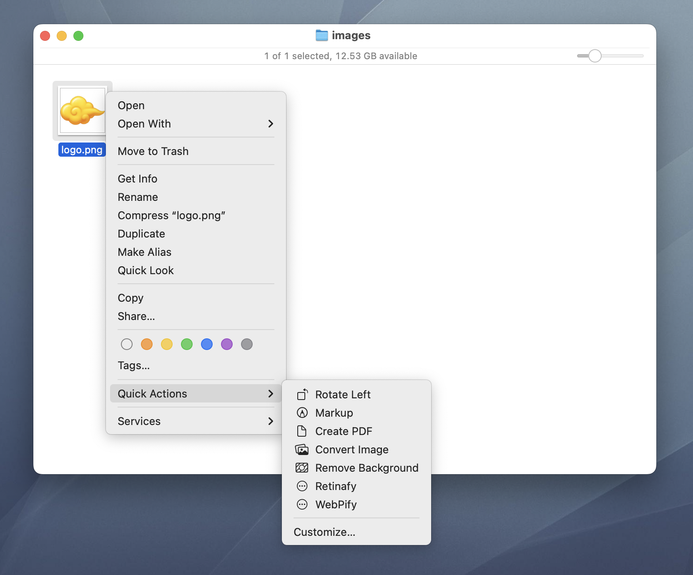

# WebPify

WebPify is a simple Automator Quick Action that lets you convert images to WebP with one click.

## What It Does

- Converts `your-name.png` to `your-name.webp` losslessly while preserving the original color profile.
- (Optional) Resizes the converted WebP image.

## Installation

1. Install `cwebp` using Homebrew: `brew install webp`.
2. Clone or download the source code.
3. Double-click `WebPify.workflow` to install.
4. You're all set!

## Sidenote

Check out [Retinafy](https://github.com/felixding/retinafy), my other Automator Quick Action that Retinafies your images.
